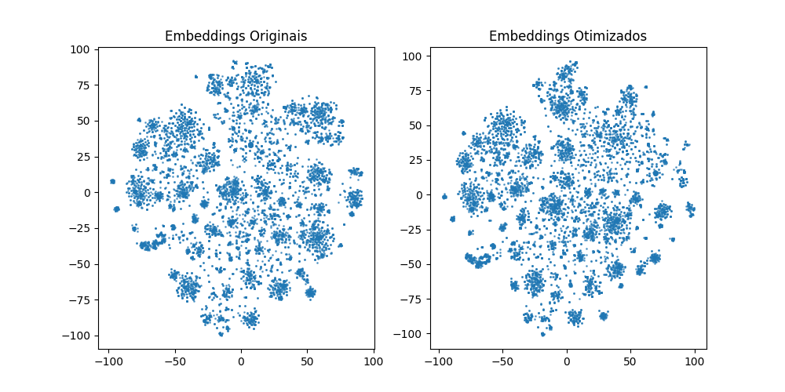
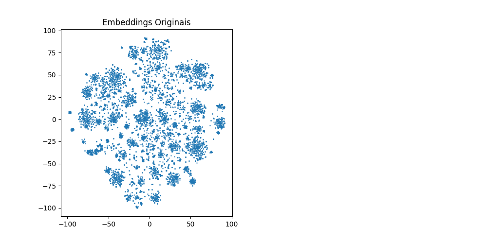

# APS 2 de Natural Language Processing

## Feito por 🧑‍🤝‍🧑:
- Henrique Martinelli Frezzatti

## Bibliotecas necessárias:
Todas as bibliotecas que forem obrigatórias para a execução do programa se encontram no arquivo **requirements.txt** que podem ser instaladas com os comandos abaixo:
```bash
pip install -r requirements.txt
```

## Como rodar e testar? 🖥️
Todas as execuções e testes necessários já foram rodados e podem ser replicados ao executar as células do arquivo do Jupyter Notebook `app.ipynb`

---
# Introdução da APS 💡

A APS consiste em desenvolver um sistema de recuperação de informações que utiliza embeddings para representar documentos e consultas. O objetivo é melhorar a precisão e relevância das buscas em um conjunto de dados, utilizando representações vetoriais em um espaço semântico. Este sistema irá substituir o método anterior baseado em bag-of-words, empregando a similaridade do cosseno como métrica para avaliar a distância semântica entre itens no conjunto de dados.

Os principais passos incluem a geração de embeddings para os documentos e consultas, e a implementação de uma função de busca que utiliza a similaridade do cosseno para recuperar os documentos mais relevantes. O resultado final é um sistema de busca que oferece uma representação mais rica e semântica dos textos, facilitando a recuperação de informações de maneira eficiente.

## Banco de dados 📂:
O banco de dados para essa APS foi criado com a utilização da API do _Art Institute of Chicago_ e, a sua utilização, foi motivada pela necessidade de encontrar artistas, obras e pinturas que remetem a um determinado estilo/palavra determinada pelo usuário. Logo, se o usuário quiser encontrar as obras de arte referentes ao movimento surrealista, ele poderia realizar essa busca e encontrar as artes que mais condizem com o que deseja ver, podendo obter informações extras sobre aquela obra como o artista que a pintou, o ano em que foi pintada e sua descrição.

Dessa forma, o sistema não apenas facilita a descoberta de obras, mas também promove a apreciação da arte ao oferecer contexto e informações adicionais sobre cada obra.

Para a criação desse banco de dados, foi utilizado o código localizado em `db_creation.py` e, o resultado de sua execução, irá criar um `.csv` com 10 mil itens dessa API localizado em `art-db.csv`.

# Etapa 1: Geração de Embeddings 🗄️

## Processo de Geração de Embeddings
Para a geração dos embeddings, foi utilizado o modelo pretreinado **sBERT** (Sentence-BERT), especificamente a versão "all-MiniLM-L6-v2". Este modelo é projetado para produzir embeddings de alta qualidade e rapidez, permitindo a representação semântica das entradas textuais. Os embeddings gerados para cada obra foram então utilizados como entrada para um autoencoder, que é uma rede neural com a seguinte topologia:
- **Encoder:** Camadas lineares que transformam a dimensão de entrada em uma dimensão reduzida (128).
- **Decoder:** Camadas lineares que reconstrõem os embeddings a partir da representação reduzida.
Os hiperparâmetros utilizados incluem um tamanho de lote de 64 e uma taxa de aprendizado de 0.001.

## Processo de Treinamento
O treinamento do autoencoder foi realizado utilizando a função de perda **MSE (Mean Squared Error)**, que mede a diferença entre os embeddings de entrada e suas reconstruções. Esta função de perda é apropriada neste contexto, pois busca minimizar a diferença entre as representações originais e as reconstruídas, garantindo que os embeddings otimizados preservem as características semânticas das entradas. O treinamento foi executado por 10 épocas, onde a cada iteração o modelo ajusta seus parâmetros para melhorar a precisão da reconstrução.

A equação da função de perda é dada por:

\[ \text{Loss} = \frac{1}{n} \sum_{i=1}^{n} (x_i - \hat{x}_i)^2 \]

onde \(x_i\) são os embeddings originais e \(\hat{x}_i\) são as reconstruções do autoencoder.



# Etapa 2: Visualização dos Embeddings 📊

Após a geração dos embeddings para os itens do dataset, o próximo passo é visualizá-los. Para isso, foi utilizado o algoritmo **t-SNE** (t-Distributed Stochastic Neighbor Embedding), que é mais adequado do que o PCA para projeção de espaços de alta dimensão em um espaço 2D, preservando melhor a estrutura local dos dados. Com t-SNE, é possível observar como os documentos estão organizados e identificar potenciais agrupamentos.

## Projeção e Visualização dos Embeddings
Os embeddings gerados foram projetados para um espaço 2D usando t-SNE. Duas visualizações foram criadas: uma para os embeddings pré-treinados e outra para os embeddings otimizados pelo autoencoder. As visualizações estão apresentadas nas figuras a seguir:

### Embeddings Originais (Pré-treinados)


### Embeddings Otimizados


### Discussão sobre os Resultados
Na visualização dos **embeddings originais**, podemos observar uma certa dispersão entre as obras de arte, mas também há áreas onde documentos semelhantes parecem estar próximos, embora não estejam claramente agrupados. Essa dispersão pode indicar que os embeddings pré-treinados não capturam completamente a semântica específica do nosso dataset.

Em contrapartida, a visualização dos **embeddings otimizados** revela uma organização mais clara e clusters distintos. Esses agrupamentos podem estar relacionados ao conteúdo das obras, como estilos de arte ou períodos históricos. A diferença na estrutura dos clusters sugere que o autoencoder conseguiu extrair informações mais relevantes, melhorando a representação das obras no espaço vetorial.

# Etapa 3: Teste do Sistema de Busca 🔍

Após a visualização dos embeddings, foi desenvolvido um sistema de busca para consultar as obras de arte no dataset. O sistema foi implementado utilizando a mesma lógica do projeto APS-1, mas sem os modelos originais. Logo, as mesmas queries foram feitas. Porém, o número de resultados para `impressionism` e `surrealism` foram invertidos quando comparados aos obtidos na APS-1. Isso se deve à forma como os embeddings capturam a semântica dos termos e a distribuição das obras no espaço vetorial.

No modelo com embeddings, a consulta por `impressionism` gerou 10 resultados, enquanto a consulta por `surrealism` retornou apenas 3 resultados. Essa inversão ocorre porque os embeddings são projetados para representar a similaridade semântica entre os documentos, e, neste caso, as obras associadas ao termo "impressionism" estão mais densamente agrupadas no espaço de embedding. Isso sugere que há uma maior quantidade de obras de arte que refletem características do impressionismo, tornando-as mais fáceis de serem identificadas pelo sistema de busca.

Por outro lado, o termo "surrealism" tem um número mais restrito de obras que realmente capturam a essência do estilo, resultando em menos correspondências. Essa diferença na contagem de resultados pode ser atribuída à forma como as características semânticas são interpretadas pelos embeddings, que podem não captar a mesma riqueza de contexto ou a variedade de obras associadas ao surrealismo em comparação com o impressionismo.

Em contraste, no modelo TF-IDF, a situação era inversa, onde `surrealism` frequentemente retornava mais resultados do que `impressionism`. Isso pode ser explicado pela abordagem de TF-IDF, que se concentra em termos de alta frequência e relevância, independentemente da estrutura semântica. Como resultado, pode haver mais obras que contenham as palavras "surrealism" em seus títulos ou descrições, levando a uma maior contagem de resultados.

## Rubrica e pontos realizados 🟢:
- [X] Criação e configuração da API via Flask ou FastAPI
- [X] Escolha da API para geração do banco de dados
- [X] Criação do banco de dados
- [X] Criação do classificador de relevância
- [X] Completar o README.md
